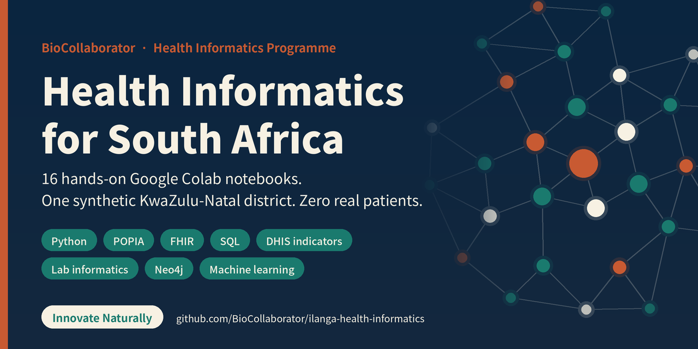

# BioCollaborator Health Informatics Programme
### *Innovate Naturally* · A South African health informatics journey in 16 hands-on modules

Welcome. I built this programme for anyone curious about health informatics in South Africa — nurses and med techs
who want to work with data, developers and analysts who want to work in health, and students still deciding which of
those they are. You don't need to have written code before. You do need curiosity.

You'll learn the way people actually work in health data teams. You join **Nqaba Health Informatics**, a (fictional)
company contracted to **Ilanga District Health Services** in KwaZulu-Natal. Every module opens with a ticket from a
real-feeling person — a clinic operational manager, a district information manager, a lab manager — and ends when your
work passes an automated quality gate and you've written a handover note.

Everything is **synthetic**. Ilanga District, its clinics, its 20,000 patients and every lab result are generated by
code in this repository. No real person's information is ever used.

---

## Start here

1. Open **Module 01** in Google Colab — click the badge at the top of the notebook, or go to
   `notebooks/phase1_onboarding/` and open it in Colab.
2. In Colab, **File → Save a copy in Drive**.
3. Run the first cell (Shift + Enter). It downloads the course platform and says hello.

That's it. No installs, no local setup. A modest laptop and a data connection are enough — the dataset is generated
inside your session, so there's no big download.

---

## The programme

| Phase | Module | Ticket | Status |
|---|---|---|---|
| **1 · Onboarding** | 01 · Sawubona! The SA health data landscape | NQ-001 | ✅ Ready |
| | 02 · Python & pandas: the PHC headcount report | NQ-002 | ✅ Ready |
| | 03 · Building Ilanga: synthetic data done right | NQ-003 | ✅ Ready |
| | 04 · POPIA on day one: governance & de-identification | NQ-004 | ✅ Ready |
| **2 · Data engineering** | 05 · Data quality & patient matching (the raw layer) | NQ-005 | 🔜 |
| | 06 · Clinical terminologies: ICD-10, LOINC, SNOMED CT, medicine codes | NQ-006 | 🔜 |
| | 07 · Interoperability: HL7 v2, FHIR and the HNSF | NQ-007 | 🔜 |
| | 08 · SQL, pipelines & a district data warehouse | NQ-008 | 🔜 |
| **3 · Analytics** | 09 · Routine indicators & the HIV and TB cascades | NQ-009 | 🔜 |
| | 10 · Epidemiology & biostatistics | NQ-010 | 🔜 |
| | 11 · Dashboards & geospatial analysis | NQ-011 | 🔜 |
| | 12 · Laboratory informatics & turnaround time | NQ-012 | 🔜 |
| **4 · Advanced & capstone** | 13 · Knowledge graphs with Neo4j | NQ-013 | 🔜 |
| | 14 · Machine learning: predicting loss to follow-up, fairly | NQ-014 | 🔜 |
| | 15 · GenAI & NLP for multilingual clinical text | NQ-015 | 🔜 |
| | 16 · Capstone: an e-Impilo / NHI-readiness report | NQ-016 | 🔜 |

See [`docs/CURRICULUM.md`](docs/CURRICULUM.md) for learning outcomes per module.

---

## What makes this different

- **One district, sixteen modules.** Every notebook uses the same Ilanga dataset, so your understanding compounds.
  The patient you de-identify in Module 4 is the duplicate you match in Module 5 and the FHIR resource you build in Module 7.
- **Two ways in.** 🩺 *Clinic Corner* gives health context to people from tech; 💻 *Code Corner* explains the code
  to people from health. Nobody is left behind, and nobody is bored.
- **Three levels of challenge.** 🌱 Seedling, 🌿 Sapling and 🌳 Baobab exercises. Three levels of hints
  (`ilanga.hint("NQ-001.1", 2)`), so you take only the help you need.
- **Real engineering habits.** Quality gates that recompute answers from the data (nothing to copy), a data
  catalogue, seeded and versioned datasets, independent implementations of critical logic, access logs, handover notes.
- **South African to the core.** POPIA, e-Impilo, HPRS, DHIS, NHLS, the quadruple burden of disease, the digital
  divide between urban and rural facilities — and a dated **Policy Watch** in every module so the context stays honest.
- **Ubuntu.** *Umuntu ngumuntu ngabantu.* Every module pauses on the people behind the rows.

---

## Repository layout

```
ilanga/                 the shared data platform (Python package)
  generator.py          synthetic district generator (curated + raw layers)
  dictionary.py         data catalogue with privacy classifications
  sa_id.py              SA ID number validation & synthetic generation
  tickets.py            quality gates and progressive hints
  brand.py              BioCollaborator notebook styling
notebooks/              student editions (what learners open)
facilitator/            facilitator editions with worked solutions (git-ignored: never published)
docs/                   curriculum, data specification, notebook standard
tools/                  notebook sources and the build script
tests/                  executes every notebook end to end
```

## For facilitators and contributors

Notebooks are generated from source files in `tools/` so the student and facilitator editions never drift apart.

```bash
python tools/build_all.py        # rebuild both editions
python tests/run_notebooks.py    # every facilitator notebook must pass its gate; every student notebook must run
```

Change content in `tools/mXX.py`, never in the `.ipynb` files directly. If you publish the repository somewhere other
than `github.com/BioCollaborator/ilanga-health-informatics`, update `REPO_SLUG` in `tools/nb.py` and rebuild.

The `facilitator/` folder is listed in `.gitignore`, so pushing this repository publishes only the student
editions. Share facilitator editions privately with facilitators.

---

## Licence and citation

- **Course content** (notebooks, docs, images): [CC BY-NC-SA 4.0](LICENSE-CONTENT.md). Free to learn from, teach with
  and adapt non-commercially, with credit. For commercial licensing, contact thembelihlegumede@biocollaborator.com.
- **Code** (`ilanga/`, `tools/`, `tests/`): [MIT](LICENSE).
- Using this in research or teaching? Click **"Cite this repository"** on GitHub (see `CITATION.cff`).

---

**BioCollaborator** · Durban, South Africa · [linkedin.com/company/biocollaborator](https://linkedin.com/company/biocollaborator)
Nqaba Health Informatics and Ilanga District are fictional. All data is synthetic. Parameters are illustrative, not
official statistics.
